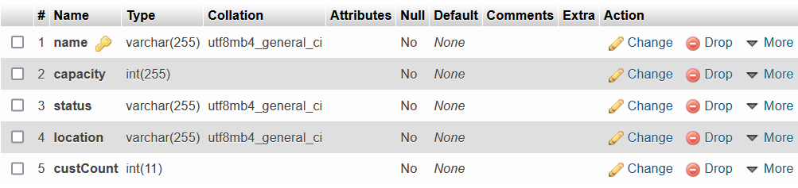

# Simple Hotel Management System

## A simple application that helps keep track of all your hotel needs, both from a guest perspective and an admin perspective.

This project is built using Java and JavaFX while also integrating a MySQL database, and while remaining simple to navigate, will allow users (both guests and admins) to do the following tasks respectively:

Guests:

* Add ratings to the currently checked-in hotel.
* Book hotel facilities remotely.
* Order additional amenities, such as additional toothbrushes .
* Set a wake-up call time.
* Set room status to do not disturb.

Hotel Admins:

* View room details, such as room capacity, its status (booked or not), etc.
* View reservation details that include the ID of the guest currently checked-in, when they checked-in, and what room they're currently staying at.
* Update and keep track of amenity stocks.
* Update and keep track of the status of hotel facilities, such as the gym or spa.
* View user ratings thus far.

## How to install and use this project
    
1. Clone this project
2. Create a MySQL database named hotel_management using the XAMPP Control Panel following the format of the following database:
   Tables:  
   
   
   With each table containing the following columns:
   
   Amenities Req:  
   
   
   Booking:  
   
   
   Facility:  
   
   
   Facility Book:  
   
   
   Inventory:  
   
   
   Rating:  
   

   Room:  
   
   
   User:  
   
   
   The information shown are examples, feel free to edit the data to your liking.
   
3. Once the dataset is properly set up, import the JavaFX library, JFXtras library and the MySQL Connector for JavaFX into the project build path in your prefered IDE.
4. Run the Main.Java file and enjoy!

## Demonstration:

Example 1:
Say that I am a guest checked-in at a hotel and would like an extra bed in my room. Instead of having to call the receptionist and hope they remember your request, I could utilize this application and do just that without worrying. Here's how it works:

   Start up the application and login with the registered credentials. In this case, the credentials entered are that of a guest.  
   If guest never visit the hotel or never have an account then they can go to register page :  
   
   
   Credentials for testing  
   Email: patrice@gmail.com  
   Password : user1234  
   
   
   If the credentials are correct and user have booked a room, the app will direct the guest to the guest home page like so:  
   
   
   Instead, if user haven't booked any room, the app will show a warning message: 
    
    
   Since in this case the guest would like to order additional amenities, they would go to the Order Amenities page by clicking on it, redirecting them to this page:  
   
   
    
   Here, guests can choose from the available amenities and their quantity. Since the guest would like to order one additional extra bed, they would select Extra Bed from the drop down menu of available amenities and set the quantity to 1 like so:  
   
   

   Once they press submit, a prompt will show that their order has been placed, and the hotel admins will be notified in return, as the database has been updated.  
   
   
   

   
    
   And as simple as that, an extra bed order has been placed.
    
    
Example 2: Say that I am a hotel admin that wants to check up on the hotels' amenities stock and at the same time, check if any of them are being ordered. Instead of having to confirm with the hotel receptionist every now and then, the application can help them do just that. Here's how it works:

   Start up the application and login with the registered credentials. In this case, the credentials entered are that of an admin.  
   
   Credentials  
   Email : admin@gmail.com  
   Password : Admin1234  
   
   
   
   If the credentials are correct, the app will direct the admin to the admin home page like so:   
   
   
   

   
   Since in this case the admin would like to check on the amenities, they would go to the Amenities page by clicking on it, redirecting them to this page:   
   
   
   
    
    
   From here the admin can check on the current stock that each available amenity has. However, notice that on the bottom of the screen, a request for an extra bed is shown. This is because of the guests' request that we placed before.
   The admin can click deliver from the page and notify the room service servers of this request like so:  
   
   
   

 
   And with that, the chance of a forgotten request placed by a guest has been further reduced.

